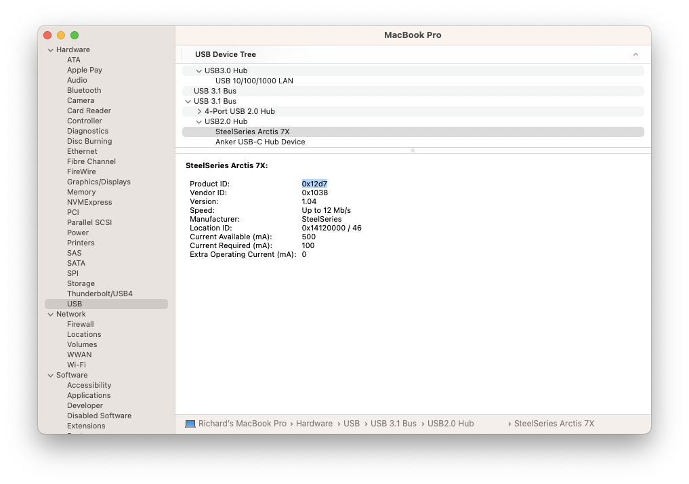

# Arctis USB Finder

[](https://github.com/richrace/arctis-usb-finder/actions/workflows/ci.yml)
[](https://github.com/richrace/arctis-usb-finder/actions/workflows/npm-publish.yml)
[](https://npmjs.org/package/arctis-usb-finder)
[](https://codeclimate.com/github/richrace/arctis-usb-finder)
[](https://codecov.io/gh/richrace/arctis-usb-finder)

Finds known Arctis headsets that are currently plugged in via the USB dongle.

## Supported Headphones

* Arctis Pro Wireless
* Arctis 7 2017
* Arctis 7 2019
* Arctis Pro 2019
* Arctis Pro GameDac
* Arctis 9
* Arctis 1 Wireless
* Arctis 1 Xbox
* Arctis 7X
* Arctis 7 Plus
* Arctis 7P Plus
* Arctis 7X Plus
* Arctis 7 Destiny Plus
* Arctis Nova 7
* Arctis Nova 7 Diablo IV
* Arctis Nova 7X
* Arctis Nova 7X V2
* Arctis Nova 7P
* Arctis Nova Pro Wireless
* Arctis 7P

See [Probe](#probe) for how to get find new devices.

## Usage

Install the package:
```
npm install arctis-usb-finder
```

Require the package:
```js
const ArctisUsbFinder = require('arctis-usb-finder');
```

Use it:
```js
const arctisUsbFinder = new ArctisUsbFinder();
arctisUsbFinder.loadHeadphones()
let headphones = arctisUsbFinder.simpleHeadphones()

// Sometime later
arctisUsbFinder.refreshHeadphones()
headphones = arctisUsbFinder.simpleHeadphones()
// or
arctisUsbFinder.loadHeadphones()
headphones = arctisUsbFinder.simpleHeadphones()
```

Data structure:
```js
[
  {
    isMuted: false,
    isCharging: false,
    isDischarging: true,
    isConnected: true,
    vendorId: 4152,
    productId: 4823,
    modelName: 'Arctis 7X',
    batteryPercent: 58,
    path: 'IOService:/AppleACPIPlatformExpert/PCI0@0/AppleACPIPCI/XHC1@14/XHC1@14000000/HS06@14100000/USB2.0 Hub             @14100000/AppleUSB20Hub@14100000/AppleUSB20HubPort@14120000/SteelSeries Arctis 7X@14120000/SteelSeries Arctis 7X@3/AppleUserUSBHostHIDDevice'
  }
]
```

And using the data structure we get back, as long as we have the path, we can refresh the devices we have connected

```js
const headphones = refreshHeadphones(
  [
    {
      // Not required
      isMuted: true, // Changed
      isCharging: false,
      isDischarging: true,
      isConnected: true,
      modelName: 'Arctis 7X',
      batteryPercent: 50, // Changed
      // Optional either
      // Path
      path: 'IOService:/AppleACPIPlatformExpert/PCI0@0/AppleACPIPCI/XHC1@14/XHC1@14000000/HS06@14100000/USB2.0 Hub             @14100000/AppleUSB20Hub@14100000/AppleUSB20HubPort@14120000/SteelSeries Arctis 7X@14120000/SteelSeries Arctis 7X@3/AppleUserUSBHostHIDDevice',
      // or Vendor ID AND Product ID
      vendorId: 4152,
      productId: 4823,
    }
  ]
)
```

### Note

* If the `isMuted`, `isCharging`, `isDischarging` or `isConnected` flags are not supported, they would return `undefined`. They are defined per Model you can see which headphones are supported [here](src/headphone_list.ts). The `path` is the `HID` path.
* `refreshHeadphones` requires a `path` value; it will not pick up additional headphones or headphones moved to another port.

## Development

Use `npm install` to install all the dependencies and `npm test` to run the tests.

### Probe

Install this package `npm install arctis-usb-finder`, which will give you access to the executable `arctis-usb-finder-probe`. This will search for known USB dongles and will report the technical details so it can be added via an Issue.

E.g.

```
Product: SteelSeries Arctis 7X
Product ID: 4823
Bytes: [ 6, 18 ]
Report: [
  6, 18, 1, 0, 0, 1, 34, 142, 1,
  0,  0, 0, 0, 0, 0,  0,   0, 0,
  0,  0, 0, 0, 0, 0,  0,   0, 0,
  0,  0, 0, 0
]
path: 'IOService:/AppleACPIPlatformExpert/PCI0@0/AppleACPIPCI/XHC1@14/XHC1@14000000/HS06@14100000/USB2.0 Hub             @14100000/AppleUSB20Hub@14100000/AppleUSB20HubPort@14120000/SteelSeries Arctis 7X@14120000/SteelSeries Arctis 7X@3/AppleUserUSBHostHIDDevice'
```

You may get something like this:

```
Product: SteelSeries Arctis 7X
Product ID: 4823
Bytes: undefined
Report: undefined
Path: IOService:/AppleACPIPlatformExpert/PCI0@0/AppleACPIPCI/XHC1@14/XHC1@14000000/HS06@14100000/USB2.0 Hub             @14100000/AppleUSB20Hub@14100000/AppleUSB20HubPort@14120000/SteelSeries Arctis 7X@14120000/SteelSeries Arctis 7X@3/AppleUserUSBHostHIDDevice
```

This means that we know what the `Product ID` is but not what the `Bytes` are to get the information via the `report`. Create an Issue with this text.

To confirm a Product ID, you can open your system information, copy the highlighted text in the screenshot below and Google `0x12d7 to decimal`.



# Credits

Inspired by https://github.com/atagulalan/arctis-battery-percentage

Original work done by [Fabien LOISON](https://blog.flozz.fr/2020/05/25/reverse-engineering-recuperer-le-niveau-de-batterie-du-casque-sans-fil-steelseries-arctis-7/)
